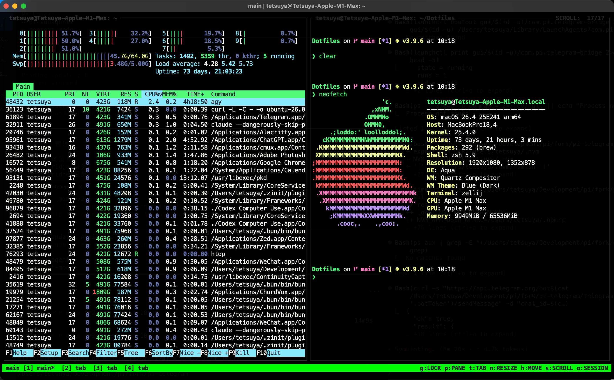

# zellij-cb

A fork of [ndavd/zellij-cb](https://github.com/ndavd/zellij-cb). Built on top of the original implementation and MIT license, this fork includes visual and interaction refinements to the status bar, aiming to provide a closer tmux-like experience within Zellij.



## Features

- Displays tabs in tmux style: e.g. `[1]name*`
- Green background with dark text for a tmux-inspired look
- Shows available keybindings for the current mode in the status bar
- Displays the session name on the left with improved layout and alignment

## Preview

```text
 main  [1]zsh*  [2]vim
 g:LOCK p:PANE t:TAB n:RESIZE h:MOVE s:SCROLL o:SESSION
```

## Installation

### 1. Build and install

Make sure you have the Rust toolchain installed with the `wasm32-wasip1` target.

```bash
./build.sh
```

This will compile the plugin and copy `zellij-cb.wasm` to `~/.config/zellij/plugins/`.

## Configuration

Register the plugin in `~/.config/zellij/config.kdl`:

```kdl
plugins {
    zellij-cb location="file:~/.config/zellij/plugins/zellij-cb.wasm"
}
```

Use it in a layout:

```kdl
layout {
    default_tab_template {
        children
        pane size=1 borderless=true {
            plugin location="zellij-cb" {
                DisplaySessionDirectory "false"
                DefaultTabName "tab"
            }
        }
    }
    tab name="main"
}
```

## Options

| Option | Description | Default |
|---|---|---:|
| `DefaultTabName` | Default name for unnamed tabs | `tab` |
| `DisplaySessionDirectory` | Whether to show the session directory in the status bar | `false` |
| `FgColor` | Foreground color (8-bit or RGB) | `0` |
| `BgColor` | Background color (8-bit or RGB) | `10` |

## Mode hint bar

The hint bar at the bottom shows context-sensitive keybindings depending on the current mode:

| Mode | Hints |
|---|---|
| Normal | `g:LOCK p:PANE t:TAB n:RESIZE h:MOVE s:SCROLL o:SESSION` |
| Locked | `g:UNLOCK` |
| Pane | `[PANE] n:New d:Down r:Right x:Close f:Full p:Next` |
| Tab | `[TAB] n:New x:Close r:Rename h/l:Move s:Sync` |
| Resize | `[RESIZE] h/j/k/l or +/-: Resize` |
| Move | `[MOVE] h/j/k/l: Move Pane` |
| Scroll | `[SCROLL] u/d: Half Pg U/D Up/Down /: Search` |

## Notes

This fork does not aim to rewrite the plugin from scratch. Instead, it applies a focused set of visual and interaction tweaks to bring the status bar closer to the tmux experience. It is a practical option for users who want a more consistent and familiar status bar in Zellij.

## Credits & License

This project is based on the original work by [Nuno David](https://github.com/ndavd) and retains the original MIT license.
