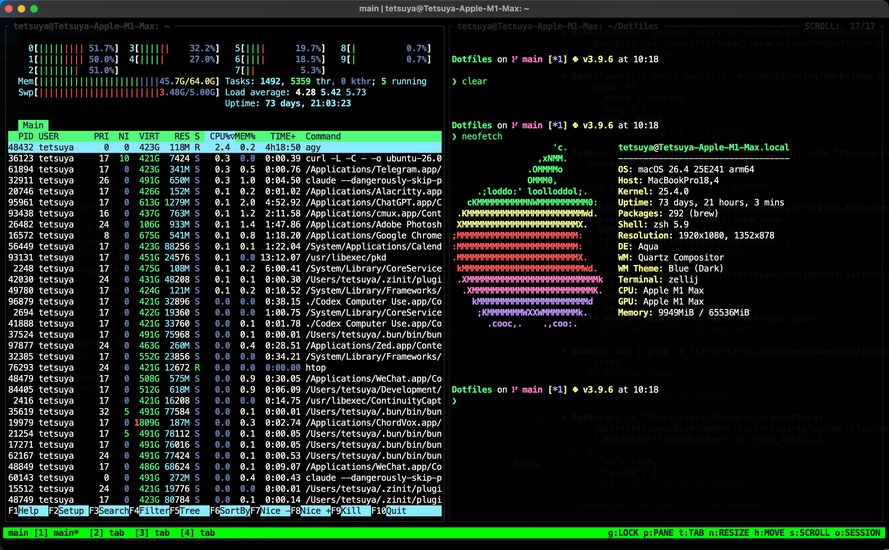

# zellij-cb

A fork of [ndavd/zellij-cb](https://github.com/ndavd/zellij-cb). Built on top of the original implementation and MIT license, this fork includes visual and interaction refinements to the status bar, aiming to provide a closer tmux-like experience within Zellij.



## Features

- Displays tabs in tmux style: e.g. `[1]name*`
- Green background with dark text for a tmux-inspired look
- Shows the local date and time to the minute on the right side of the status bar
- Displays the session name on the left with improved layout and alignment
- Optionally displays the host name and IPv4 address using platform-compatible command fallbacks.

## Preview

```text
 main  [1]zsh*  [2]vim
 g:LOCK p:PANE t:TAB n:RESIZE h:MOVE s:SCROLL o:SESSION
```

## Installation

### 1. Build and install

Make sure you have the Rust toolchain installed with the `wasm32-wasip1` target.

```bash
./build.sh
```
### Windows PowerShell

PowerShell does not run `build.sh` by default. Use the included PowerShell script instead:

```powershell
.\build.ps1
```

The script installs the `wasm32-wasip1` target when needed and copies the plugin to
`%APPDATA%\zellij\plugins\` (or `$env:ZELLIJ_CONFIG_DIR` when set).

## Configuration

Register the plugin in `~/.config/zellij/config.kdl` on Unix-like systems, or
`%APPDATA%\zellij\config.kdl` on Windows.

Unix-like systems:

```kdl
plugins {
    zellij-cb location="file:~/.config/zellij/plugins/zellij-cb.wasm"
}
```

Windows (replace `<USER>` with your Windows user name):

```kdl
plugins {
    zellij-cb location="file:C:/Users/<USER>/AppData/Roaming/zellij/plugins/zellij-cb.wasm"
}
```

The included `build.ps1` installs the WASM file to the Windows path above.

Use it in a layout:

```kdl
layout {
    default_tab_template {
        children
        pane size=1 borderless=true {
            plugin location="zellij-cb" {
                DisplaySessionDirectory "false"
                DisplayHostInfo "true"
                DefaultTabName "tab"
            }
        }
    }
    tab name="main"
}

```

## Options

| Option | Description | Default |
|---|---|---:|
| `DefaultTabName` | Default name for unnamed tabs | `tab` |
| `DisplaySessionDirectory` | Whether to show the session directory in the status bar | `false` |
| `DisplayHostInfo` | Whether to show the host name and IPv4 address | `false` |
| `LockedModeLabel` | Label shown while Zellij shortcuts are locked with `Ctrl-g` | `g:LOCK` |
| `FgColor` | Foreground color (8-bit or RGB) | `0` |
| `BgColor` | Background color (8-bit or RGB) | `10` |

## Status bar clock

The right side shows the local date and time in a full English (US) format with
the weekday and month names, such as `Friday, August 28, 2026 9:00 PM`. It is
refreshed once per minute.

| Side | Content |
|---|---|
| Left | Session name and tabs |
| Right | Full English date and time, e.g. `Wednesday, August 26, 2026 11:45 PM` |

## Locked shortcut indicator

Pressing `Ctrl-g` enters Zellij's locked mode. The status bar then shows the
tmux-style `g:LOCK` indicator next to the session and tabs, making it clear that
Zellij shortcuts are temporarily disabled. Press `Ctrl-g` again to unlock.

The label is platform-independent and uses ASCII characters so its display width
is stable in Windows Terminal, Linux terminals, and macOS terminals. It can be
customized in the layout:

```kdl
plugin location="zellij-cb" {
    LockedModeLabel "LOCKED"
}
```

Host information also uses platform-compatible commands: `ipconfig` on Windows
and Unix network command fallbacks elsewhere. The clock uses PowerShell on
Windows and `date` on Unix-like systems.

## Notes

This fork does not aim to rewrite the plugin from scratch. Instead, it applies a focused set of visual and interaction tweaks to bring the status bar closer to the tmux experience. It is a practical option for users who want a more consistent and familiar status bar in Zellij.

## Credits & License

This project is based on the original work by [Nuno David](https://github.com/ndavd) and retains the original MIT license.
